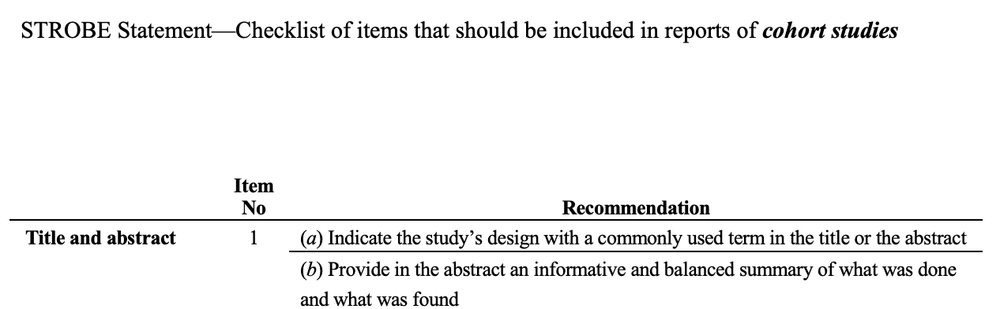
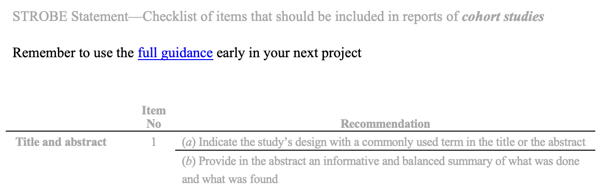
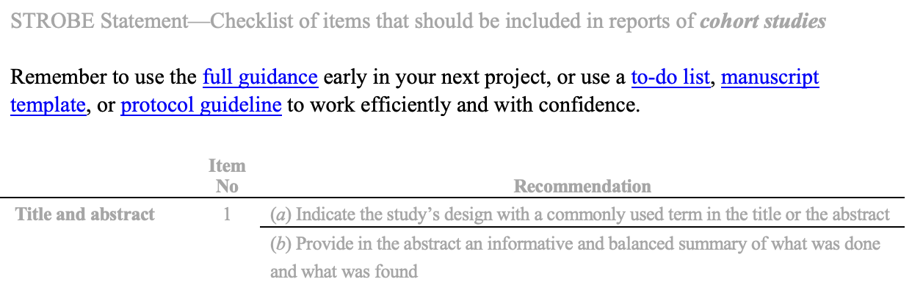

<!-- headingDivider: 1 -->
<!-- # 750 words total -->

## Using behaviour change theory to increase usage of reporting guidelines
James Harwood
DPhil @ UK EQUATOR Center
Supervisors: Prof. Gary Collins, Dr Jennifer de Beyer, Dr Michael Schlüssel, Dr Charlotte Albury

# 

# Identifying barriers

#

# Participants

Focus Groups with a purposive sample incl. EQUATOR UK, guideline developers, publishers

# Methods

# Methods

# Methods

# 

# 

# 

# 

# 

# Audience participation

#

# 

# 
Read the full guidance [here]()

# 

#  

# Thank you!
**Using behaviour change theory to increase usage of reporting guidelines**
James Harwood
DPhil @ EQUATOR Center
Supervisors: Prof. Gary Collins, Dr Jennifer de Beyer, Dr Michael Schlüssel, Dr Charlotte Albury

